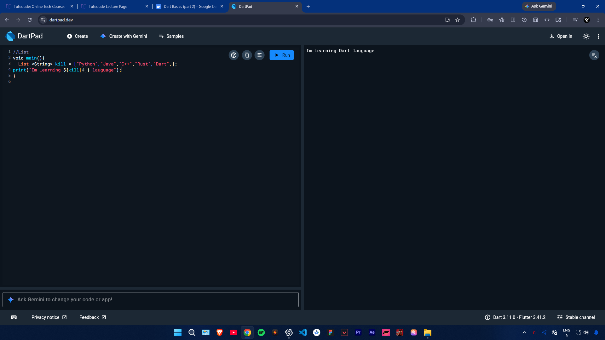
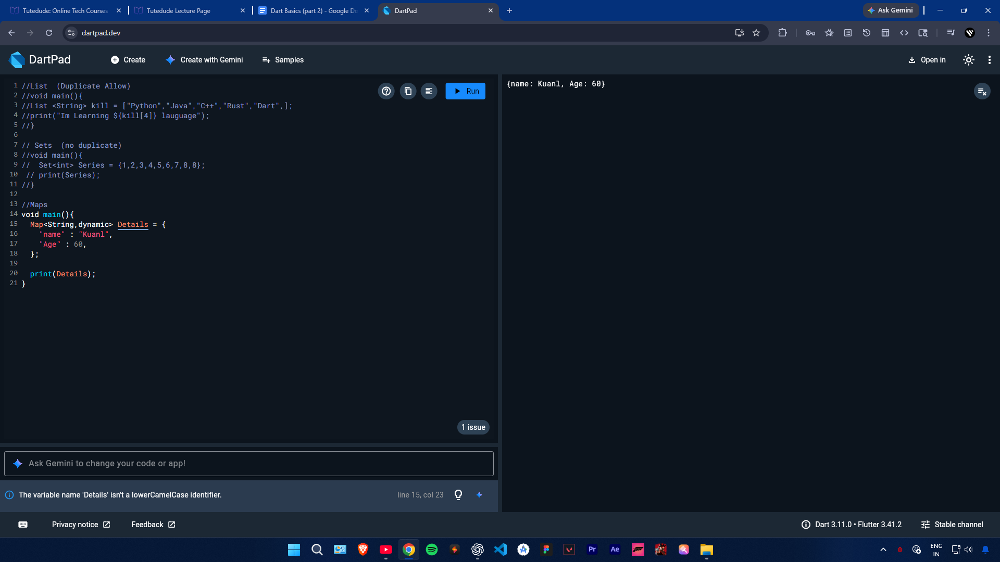
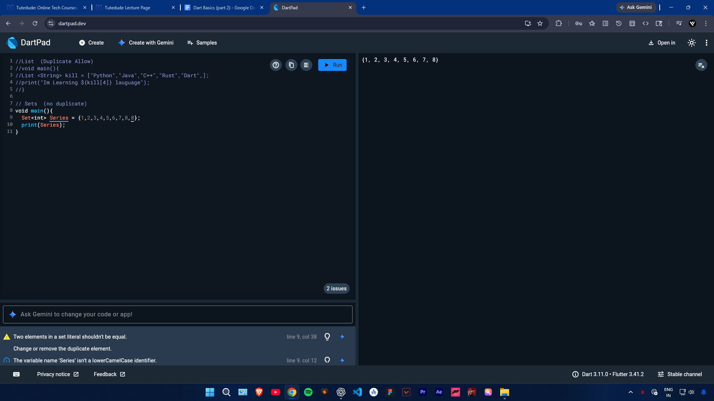
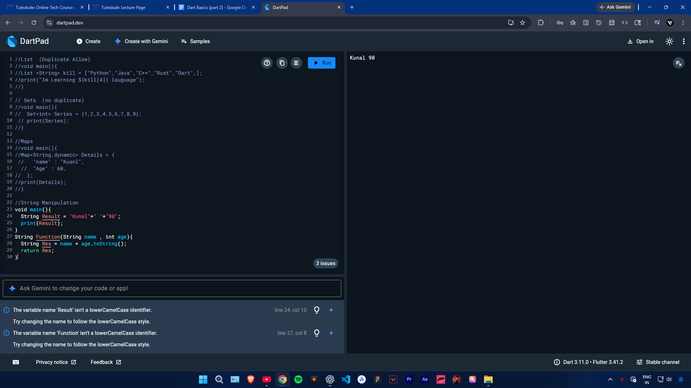

# Dart-Basic-2
## 🚀 Simple Summary:  👉 *Dart Basics 2 me aap data ko efficiently handle karna (List, Set, Map), functions ke through reusable logic banana, string ko manipulate karna, aur Class &amp; Object (OOP) ke through structured programming seekhte ho. Isme constructor aur methods ka use karke real-world data ko manage karna bhi sikhaya jata hai.*
🔹

🔹

🔹

🔹

🔹

🔹
